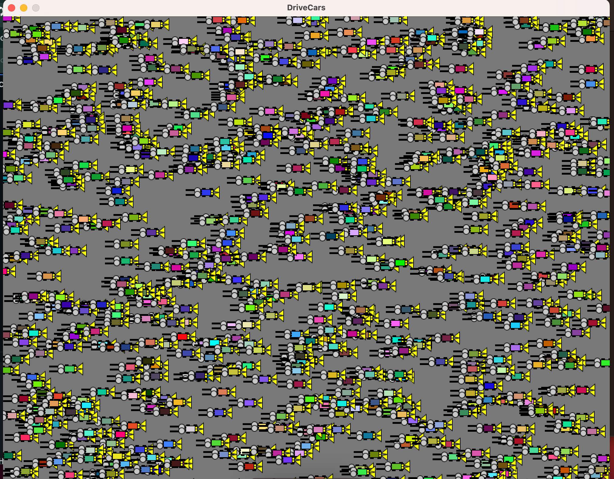
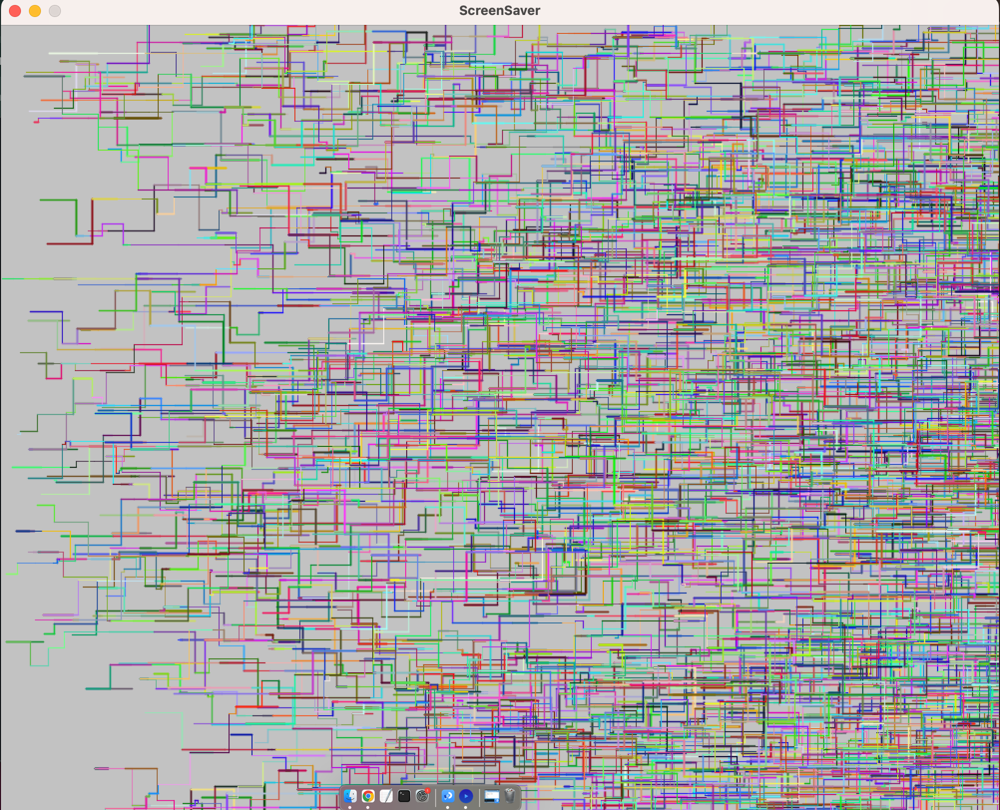
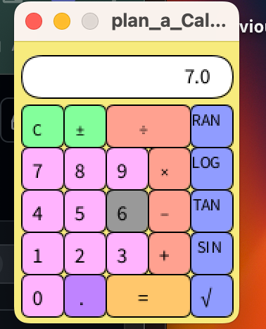

# Adele Hurley Programming Portfolio 2023 - 2024
Skyline High School Computer Programming 1

## USOE Tech Certifications

## Group Projects (2023 - 2024)

## Individual Projects (2023 - 2024)

### SpaceGame
OOP graphical game with sound and keyboard/ mouse listeners.

[Source Code](https://github.com/DeleHurl/programmingportfolio/blob/main/src/SpaceGame.zip)

### DriveCars
OOP graphical game with sound and keyboard/ mouse listeners.

[Source Code](src/DriveCars.zip)

### ScreenSaver
OOP graphical game with sound and keyboard/ mouse listeners.

[Source Code](src/ScreenSaver.zip)

### Calculator
OOP graphical game with sound and keyboard/ mouse listeners.

[Source Code](src/plan_a_Calculator.zip)

### Number Guessing Game
OOP graphical game with sound and keyboard/ mouse listeners.

[Source Code](https://github.com/DeleHurl/programmingportfolio/blob/main/src/etchASketch01.pde.zip)
